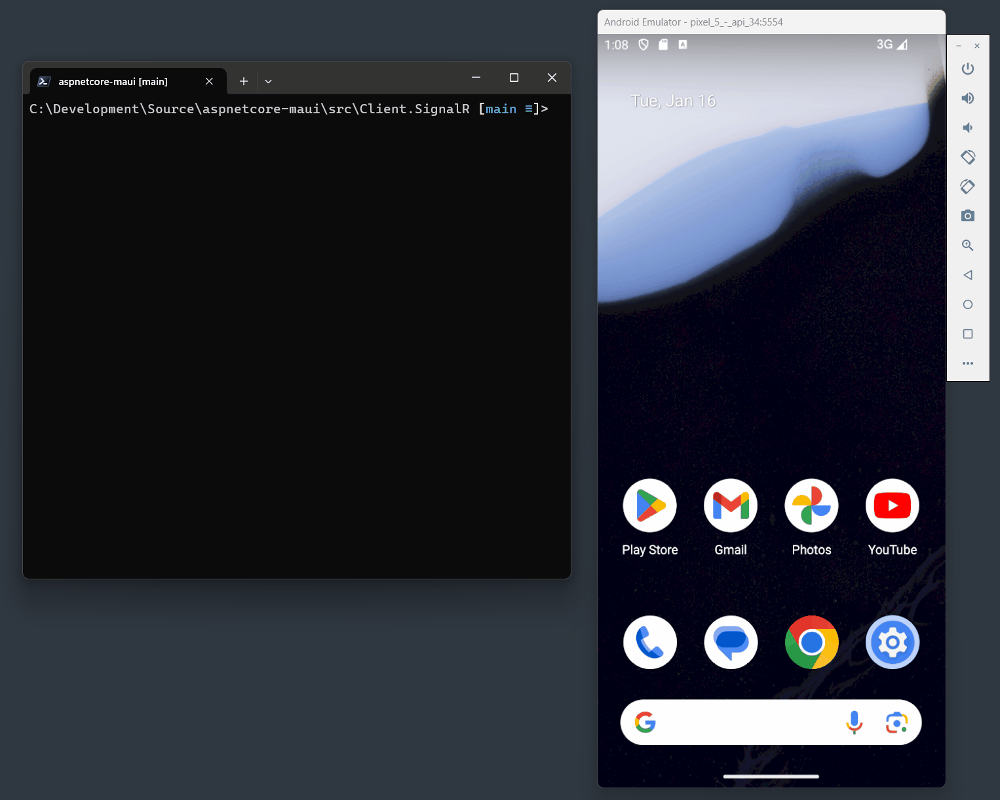

# ASP.NET Core in MAUI

This is an experiment for hosting an ASP.NET Core inside a MAUI app.

## Why

ASP.NET Core in MAUI is a [highly requested feature](https://github.com/dotnet/aspnetcore/issues/35077) (currently the 3rd most commented issue in dotnet/aspnetcore). Support for hosting an HTTP server opens up new opporunities for MAUI apps:

* Share files with desktop computers on the same network over HTTP.
* Host a web GUI control panel to remote control the mobile app (Start/stop/Record/Pause/Take photo etc)
* Expose APIs (RESTful, gRPC, or SignalR) that other devices can use to interact with the mobile app.

## Source

The repository contains a sample app that uses .NET 8 and MAUI. Hacks are required to include ASP.NET Core DLLs in the app because the  `Microsoft.AspNetCore.App` framework reference is unsupported on mobile targets: `net8.0-android`, `net8.0-ios`, `net8.0-maccatalyst`.

Solution projects:

* `MauiApp` - The MAUI app. It hosts an ASP.NET Core server. Logging from the server is output to the UI. The app responds to commands sent to the server.
* `MauiApp.Web` - A project that contains the ASP.NET Core server. The MAUI app project references this.
* `Client.SignalR` - A SignalR client used to call the MAUI app.
* `Client.Auth` - A RESTful client that authenticates with the mobile server app and calls APIs that require authorization.
* `ConsoleWebAppHost` - A console app that references `MauiApp.Web` to test out hosting the ASP.NET Core server outside of MAUI.

## Demo

